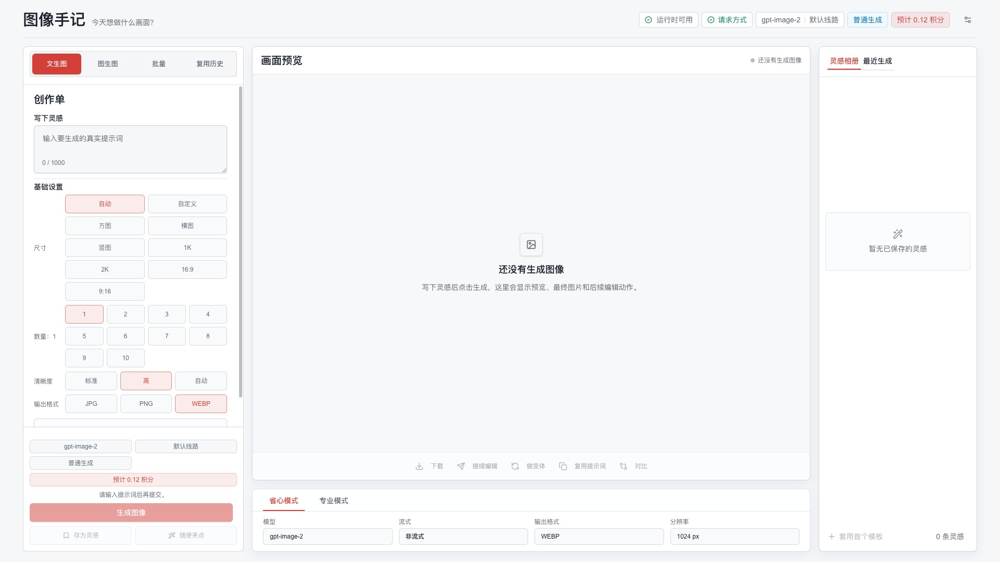
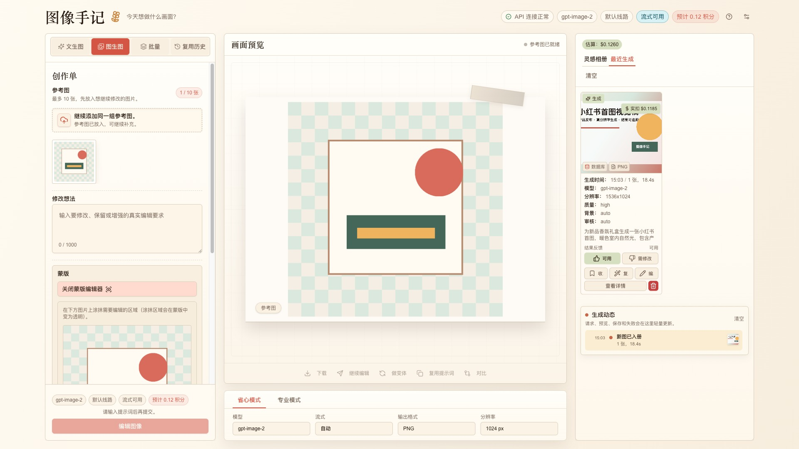
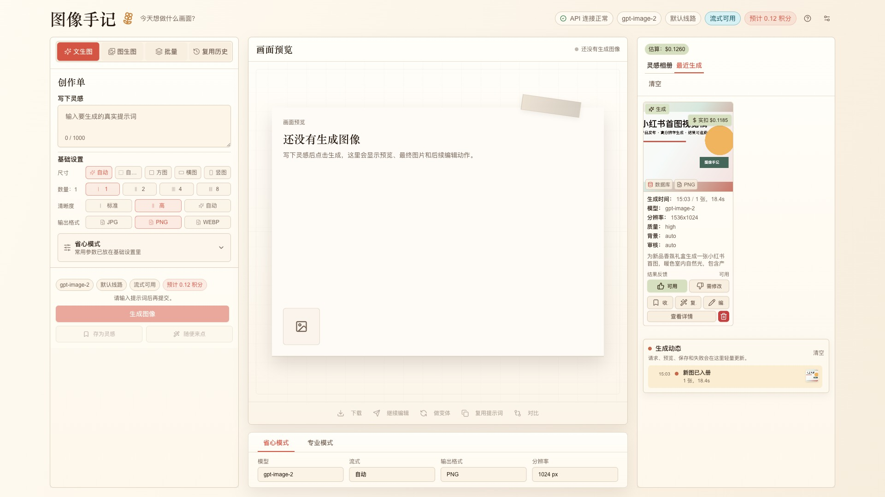
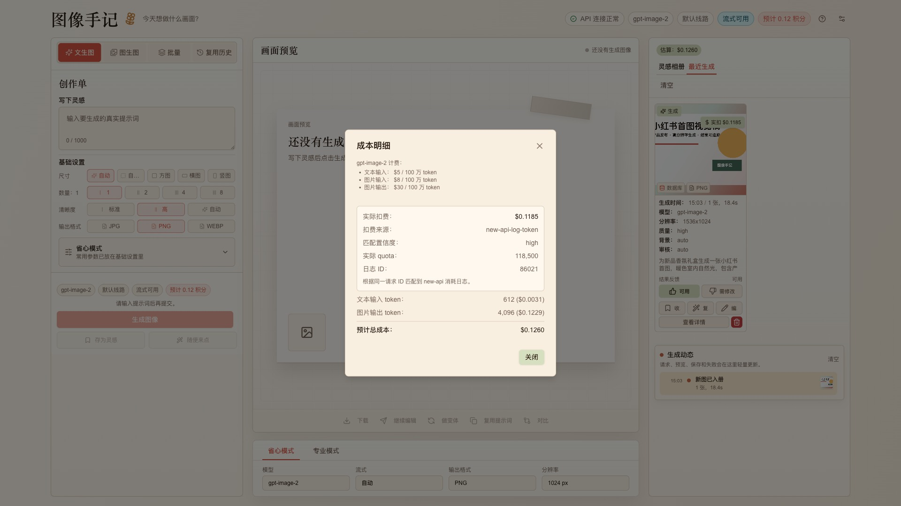

# GPT Image Playground


GPT Image Playground 是一个用于本地部署的 `gpt-image-2` 图片服务：在浏览器里调用 OpenAI Images API 或兼容接口，支持流式预览、4K 图片输出、图片编辑、遮罩编辑、历史记录和费用估算。

它和普通图片生成页面的区别是：围绕 `gpt-image-2` 的高分辨率生成能力设计，支持 2K/4K 预设和自定义尺寸，流式输出过程可见，结果默认保存在本地，参数和费用记录可追溯。

适合这些场景：

- 在本机或内网服务器部署一个可控的 `gpt-image-2` 图片生成服务。
- 验证 `gpt-image-2` 的流式预览、4K 输出、自定义尺寸和编辑参数。
- 使用 OpenAI 兼容接口时，快速确认 API URL、模型、尺寸、质量、输出格式和错误响应是否正确。

<p align="center">
  
</p>

> **4K 出图提示**：如果遇到 4K 分辨率出图失败问题（状态码 `524`），请使用 [superapi 站](https://superapi.buzz/register?aff=W0rz) 提供的 `gpt-image-2` 渠道。该渠道已适配支持 4K 流式出图，价格便宜（`0.0075` 元/张）。

## 快速开始

系统推荐采用 Docker 部署。Docker 运行环境更稳定，依赖隔离更清晰，也更适合长期本地服务或内网服务。

如果不方便使用 Docker，也支持原生启动。仓库提供 Windows、macOS、Linux 三个平台的一键启动脚本，会自动检查 Node.js、创建 `.env.local`、安装依赖并启动浏览器服务。

### 推荐：Docker 部署

1. 准备 `.env.local`：

```dotenv
OPENAI_API_KEY=your_openai_api_key_here
OPENAI_API_BASE_URL=https://api.openai.com/v1
```

多渠道部署可以改用服务端渠道池：

```dotenv
OPENAI_ROUTING_STRATEGY=round_robin

OPENAI_CHANNEL_1_ID=official
OPENAI_CHANNEL_1_BASE_URL=https://api.openai.com/v1
OPENAI_CHANNEL_1_API_KEYS=sk-primary

OPENAI_CHANNEL_2_ID=backup
OPENAI_CHANNEL_2_BASE_URL=https://your-compatible-api.example.com/v1
OPENAI_CHANNEL_2_API_KEYS=sk-backup-a,sk-backup-b

# 可选：开启并发流式批处理。默认关闭。
ENABLE_STREAMING_BATCH=true
OPENAI_MAX_STREAMS_PER_CREDENTIAL=1
```

2. 启动服务：

```bash
docker compose up -d --build
```

3. 打开：

```text
http://localhost:4783
```

### 兼容：原生一键启动

Windows：

```text
start-windows.bat
```

macOS：

```bash
./start-macos.sh
```

Linux：

```bash
./start-linux.sh
```

脚本会执行这些动作：

- 检查 `package.json` 是否位于项目根目录。
- 检查 Node.js 20 或更高版本。
- 检查 npm 是否可用。
- 如果没有 `.env.local`，自动从 `.env.example` 创建。
- 如果没有 `node_modules`，自动执行 `npm install`。
- 启动前检查 `4783` 端口是否可用，避免 Next.js 自动切换端口后打开错服务。
- 启动本地服务并尝试打开 `http://localhost:4783`。

### 手动原生启动

1. 准备环境变量：

```bash
cp .env.example .env.local
```

2. 安装依赖并启动：

```bash
npm install
npm run dev
```

3. 打开：

```text
http://localhost:4783
```

## 核心功能

- `gpt-image-2` 图片生成：根据文本提示词生成一张或多张图片。
- `gpt-image-2` 图片编辑：上传源图后用提示词修改图片，可选遮罩。
- 内置遮罩工具：直接在图片上绘制遮罩，也可以上传 PNG 遮罩。
- 完整参数控制：模型、尺寸、质量、输出格式、压缩、背景、审核级别、生成数量。
- 4K 与自定义尺寸：支持 2K/4K 预设和手动输入宽高，并在前端校验尺寸约束。
- 流式输出：支持生成和编辑过程中的 partial image 预览。
- 历史记录：保留提示词、参数、图片、耗时、token usage 和估算费用。
- 发送到编辑：从生成结果或历史记录直接进入编辑模式。
- 双语和主题：支持中文、英文、亮色、暗色。
- 两种图片存储模式：服务端文件系统或浏览器 IndexedDB。

## 编辑与遮罩

编辑模式支持最多 10 张源图。遮罩必须与源图尺寸一致，绘制或上传后会随编辑请求一起提交。

<p align="center">
  
</p>

## 历史与费用

历史面板会记录每次生成或编辑的参数和结果。返回 usage 的接口会显示 token 明细和估算费用，方便对比不同模型和参数的成本。

<p align="center">
  
</p>

<p align="center">
  
</p>

## API 设置

页面右上角的 `API 设置` 会把配置保存在当前浏览器中，不会写入源码文件。

| 配置 | 说明 |
| --- | --- |
| API Key | OpenAI 或兼容接口的密钥。 |
| API URL | OpenAI 兼容接口根地址，通常以 `/v1` 结尾。 |

常见填写方式：

```text
https://api.openai.com/v1
https://your-compatible-api.example.com/v1
```

不要填写管理后台首页或网页地址。如果接口返回 HTML，应用会提示 API URL 不是 OpenAI Images JSON 响应。

## 环境变量

| 变量 | 是否必填 | 默认值 | 说明 |
| --- | --- | --- | --- |
| `OPENAI_API_KEY` | 条件必填 | 无 | 服务端默认 API Key。也可以在页面 `API 设置` 中填写。 |
| `OPENAI_API_BASE_URL` | 否 | OpenAI 官方地址 | OpenAI 兼容接口根地址。 |
| `OPENAI_ROUTING_STRATEGY` | 否 | `sticky` | 服务端多渠道路由策略，可选 `sticky`、`round_robin`、`random`。 |
| `OPENAI_CHANNEL_N_ID` | 否 | 无 | 第 N 个服务端渠道标识，只用于日志排查。 |
| `OPENAI_CHANNEL_N_BASE_URL` | 否 | 无 | 第 N 个 OpenAI 兼容接口根地址，通常以 `/v1` 结尾。 |
| `OPENAI_CHANNEL_N_API_KEYS` | 否 | 无 | 第 N 个渠道的一个或多个 API Key，多个 key 用英文逗号分隔。 |
| `OPENAI_CHANNEL_N_FAILURE_COOLDOWN_MS` | 否 | 继承全局值 | 第 N 个渠道的失败冷却时间。 |
| `ENABLE_STREAMING_BATCH` | 否 | `false` | 显式设为 `true` 后，流式模式下 `n>1` 会拆成多个 `n=1` 任务并发执行。 |
| `OPENAI_MAX_STREAMS_PER_CREDENTIAL` | 否 | `1` | 每个服务端 credential 允许同时执行的流式任务数。 |
| `OPENAI_CHANNEL_FAILURE_COOLDOWN_MS` | 否 | `60000` | 服务端 credential 或 channel 失败后的默认冷却时间。 |
| `APP_PASSWORD` | 否 | 无 | 设置后，页面会要求输入访问密码。 |
| `APP_LOG_LEVEL` | 否 | 生产环境 `warn`，其他环境 `info` | 服务端日志等级，可选 `debug`、`info`、`warn`、`error`。 |
| `NEXT_PUBLIC_IMAGE_STORAGE_MODE` | 否 | `fs` | 可选 `fs` 或 `indexeddb`。 |

自定义 API URL 必须同时提供 API Key，避免服务器密钥被发送到未知接口。

### 服务端多渠道路由

服务端多渠道路由用于配置多个 OpenAI 兼容渠道和多个 key。页面右上角 `API 设置` 中显式填写的 API Key/API URL 仍然优先，未填写时才会使用服务端渠道池。

优先级：

```text
页面 API 设置 > OPENAI_CHANNEL_N_* 渠道池 > OPENAI_API_KEY 单 key 默认配置
```

配置字段：

| 字段 | 说明 |
| --- | --- |
| `OPENAI_ROUTING_STRATEGY` | 可选 `sticky`、`round_robin`、`random`。不填默认 `sticky`。 |
| `OPENAI_CHANNEL_N_ID` | 渠道标识，只用于日志与排查，不会暴露 API Key。 |
| `OPENAI_CHANNEL_N_BASE_URL` | 兼容接口根地址，通常以 `/v1` 结尾。 |
| `OPENAI_CHANNEL_N_API_KEYS` | 当前渠道下的一个或多个 API Key，多个 key 用英文逗号分隔。 |
| `OPENAI_CHANNEL_N_FAILURE_COOLDOWN_MS` | 可选，覆盖单个渠道的失败冷却窗口。 |

并发流式批处理默认关闭。开启 `ENABLE_STREAMING_BATCH=true` 后，页面允许在流式模式下选择多张图片；应用会把批次拆成多个独立 `n=1` 流式请求。推荐并发窗口由服务端运行时能力接口返回：默认 `sticky` 路由按单个 credential 容量计算，`round_robin` / `random` 路由按完整 credential 池计算。

`OPENAI_MAX_STREAMS_PER_CREDENTIAL` 默认是 `1`，建议只在真实上游探针验证单 key 可承受更高并发后再调大。

如果服务端 credential 返回鉴权失败、额度不足或限流错误，应用会把该 credential 标记为短暂不可用。若渠道返回 5xx、Cloudflare 520/522/523/524、连接失败或超时，应用会冷却整个 channel，并在冷却窗口内跳过该 channel 下所有 key。若兼容网关把 `invalid_api_key`、`insufficient_quota` 等 credential 错误包在 5xx 中返回，credential 错误优先，不会误冷却整个 channel。所有 credential 都在冷却中时，请求会显式失败，不会伪造成功或静默降级。

运行时能力接口会返回健康 credential/channel 数量与最近一次失败摘要（status、code、requestId），用于诊断和前端并发窗口刷新；不会返回 API Key 或上游错误消息。

三种策略：

| 策略 | 行为 |
| --- | --- |
| `sticky` | 按请求来源稳定映射到同一凭证，适合减少同一用户在多个渠道间跳转。 |
| `round_robin` | 按请求顺序轮询所有渠道 key，适合简单均摊流量。 |
| `random` | 每次随机选择一个渠道 key，适合轻量分散请求。 |

完整示例：

```dotenv
OPENAI_ROUTING_STRATEGY=sticky

OPENAI_CHANNEL_1_ID=official
OPENAI_CHANNEL_1_BASE_URL=https://api.openai.com/v1
OPENAI_CHANNEL_1_API_KEYS=sk-key-1,sk-key-2

OPENAI_CHANNEL_2_ID=backup
OPENAI_CHANNEL_2_BASE_URL=https://your-compatible-api.example.com/v1
OPENAI_CHANNEL_2_API_KEYS=sk-backup-1
```

## 图片保存位置

默认存储模式是 `fs`。生成图片会保存到项目目录：

```text
generated-images/
```

Docker 正式服务中，容器内路径是：

```text
/app/generated-images
```

宿主机映射路径是：

```text
./generated-images
```

前端读取图片时走接口：

```text
/api/image/{filename}
```

如果部署到只读或临时文件系统，可以把 `NEXT_PUBLIC_IMAGE_STORAGE_MODE` 设置为 `indexeddb`。这时图片会保存在浏览器 IndexedDB 中，服务端不落盘。

## Docker 运行

```bash
docker compose up -d --build
```

Docker 容器内外端口统一使用 `4783`。

默认访问地址：

```text
http://localhost:4783
```

查看状态：

```bash
docker compose ps
```

查看日志：

```bash
docker logs -f gpt-image-playground-customer
```

## 常用命令

| 命令 | 用途 |
| --- | --- |
| `./start-macos.sh` | macOS 原生一键启动。 |
| `./start-linux.sh` | Linux 原生一键启动。 |
| `start-windows.bat` | Windows 原生一键启动。 |
| `npm run dev` | 启动本地开发服务。 |
| `npm run build` | 执行生产构建。 |
| `npm run start` | 启动生产模式服务。 |
| `npm run lint` | 检查 `src/` 代码。 |
| `npm run format` | 格式化 `src/` 下的 TypeScript 和 React 文件。 |

## 常见问题

### 提示未检测到 Node.js

安装 Node.js 20 或更高版本，然后重新执行对应平台的一键启动脚本。

### 依赖安装失败

通常是网络无法访问 npm。确认网络后重新运行对应平台的一键启动脚本，或手动执行 `npm install`。

### API 返回 HTML 页面

说明 API URL 填成了网页或管理后台地址。请填写 OpenAI 兼容接口根地址，通常以 `/v1` 结尾。

### 生成接口提示需要 API Key

在 `.env.local` 写入 `OPENAI_API_KEY`，或在页面右上角 `API 设置` 中填写 API Key。

### 端口被占用

原生启动和 Docker 默认都使用 `4783`。如果端口打不开，先确认是否已有旧进程或旧容器正在运行。

## 技术栈

- Next.js 16
- React 19
- OpenAI JavaScript SDK
- Tailwind CSS 4
- Radix UI
- Dexie IndexedDB

## 变更记录

版本变更和未发布改动记录在 [CHANGELOG.md](./CHANGELOG.md)。

## License

MIT
